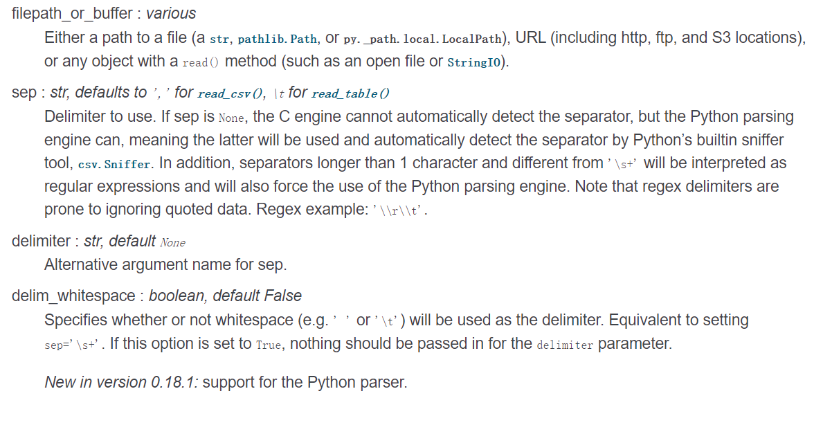

# 
Pandas

pandas是数据清洗最著名的一个库了可以说，使用频率相当的高，再次做一次总结。最常用的可能就是用dataframe来整理数据，本次整理的来源于本人的一些使用案例或者是董付国老师编著的《python程序设计基础》或是官方文档 

----整体架构借鉴于老师的ipynb文件

[官方文档](https://pandas.pydata.org/pandas-docs/stable/user_guide/io.html)
### pandas读数据
最简单也最重要的一part
pandas提供了读取和写入主流文件格式的方法，如csv，excel，json,html,HDF5 format,SQL
首先从最重要也最常用的csv文件开始 
>CSV(comma-separated value，逗号分隔值)文件格式是一种非常简单的数据存储与分享方式，以纯文本形式存储表格数据（数字和文本）。CSV文件由任意数目的记录组成，记录间以某种换行符分隔；每条记录由字段组成，字段间的分隔符是其它字符或字符串，最常见的是逗号或制表符。通常，所有记录都有完全相同的字段序列，读取csv的语句大概是长这样子的 

####`import pandas as pd`  
#### `df=pd.read_csv("filename")`
一般而言只需要指定需要读的文件信息即可，但是为了其他处理，你也可以对其他默认参数进行修改，一般读不了的文件就需要修改默认参数的值，才能正确读取文件。 
下面来扒一下read_csv方法参数的意义
##### 基本参数：filepath__or__buffer,sep,delimiter,delim_whitespace.
filepath__or__buffer,指的是文件信息，这里可以是在工作目录下的csv文件(如果找不到会报错),也可以是绝对路径下的csv文件，也可以是URL格式(直接访问网络资源，支持主流的数据传输方式)，都是str类型。 
sep:指定分隔符，默认是逗号，如果是read_table()的话默认是"\t",可以指定不同类型的分隔符，但是分隔符必须是str类型的。 
delimiter:跟sep参数已知，和sep二选一即可 
delim_whitespace：默认参数是false，参数类型为boolean，如果参数为True,则sep="\s+"

