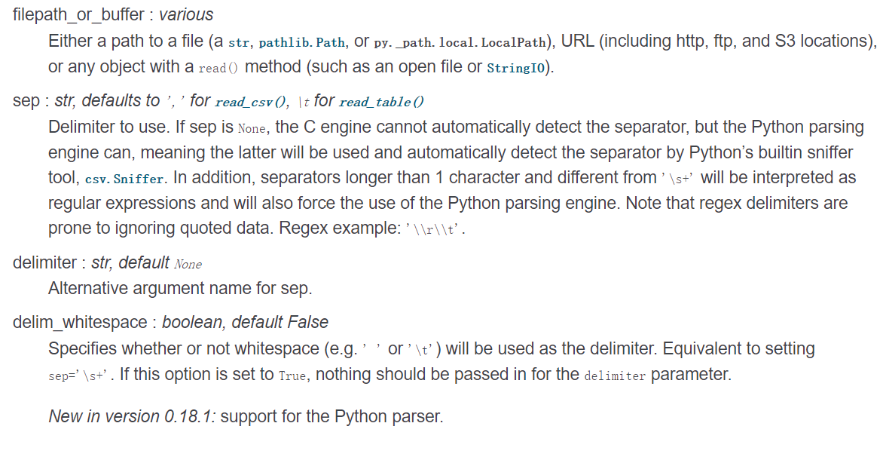
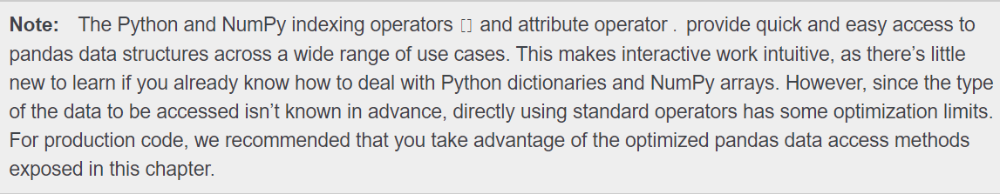

# 
Pandas

pandas是数据清洗最著名的一个库了可以说，使用频率相当的高，再次做一次总结。最常用的可能就是用dataframe来整理数据，本次整理的来源于本人的一些使用案例或者是董付国老师编著的《python程序设计基础》或是官方文档 

----整体架构借鉴于老师的ipynb文件

 [官方文档](https://pandas.pydata.org/pandas-docs/stable/user_guide/io.html) 

###  pandas读数据
 最简单也最重要的一part
pandas提供了读取和写入主流文件格式的方法，如csv，excel，json,html,HDF5 format,SQL。
首先从最重要也最常用的csv文件开始 
>CSV(comma-separated value，逗号分隔值)文件格式是一种非常简单的数据存储与分享方式，以纯文本形式存储表格数据（数字和文本）。CSV文件由任意数目的记录组成，记录间以某种换行符分隔；每条记录由字段组成，字段间的分隔符是其它字符或字符串，最常见的是逗号或制表符。通常，所有记录都有完全相同的字段序列，读取csv的语句大概是长这样子的 

#### `import pandas as pd`  
#### `df=pd.read_csv("filename")#df(whatever you want)暗指DataFrame,因为读出来的对象是dataframe类型`
read_csv()一般而言只需要指定需要读的文件信息即可，但是为了其他处理，你也可以对其他默认参数进行修改，一般读不了的文件就需要修改默认参数的值，才能正确读取文件。 
下面来扒一下read_csv方法参数的意义
> 基本参数：filepath__or__buffer,sep,delimiter,delim_whitespace.
在介绍参数时，英文部分为指定的参数的数据类型，和默认的参数值。

filepath__or__buffer：str 指的是文件信息，这里可以是在工作目录下的csv文件(如果找不到会报错),也可以是绝对路径下的csv文件，也可以是URL格式(直接访问网络资源，支持主流的数据传输方式)，都是str类型。 
sep:指定分隔符,default=",",dtype=str,如果是read_table()的话默认是"\t",可以指定不同类型的分隔符，但是分隔符必须是str类型的。 
delimiter:跟sep参数一致，和sep二选一即可 
delim_whitespace：default=false，dtype=boolean，如果参数为True,则sep="\s+" 

一些不常见但是有可能会用上的参数，其实算是数据预(预处理)，是比较高级用法，涉及到内存管理，引擎设置等，是为了更加efficient去读一个csv文件，但是绝大多数情况下都不怎么用到(像我就用到过一次),一般都是在读完csv之后对DataFrame对象进行操作，而不是在读的时候就进行操作，我更加推荐前者。

> 非常用参数： header,names,index_col,prefix,dtype,skiprows,skipinitialspace,nrows,na_values,keep_default_na,na_filter,compression等

很多的参数一看名字就知道用法，我就简单介绍，涉及用法较多，更加常用的涉及的篇幅会长一点。 
header：dtype=infer or list of ints,default="infer"，不设置列名header=0，列名会自动取文件的第一行，如果想自己设定列名(header=None，columns=[]),如果涉及到multipleindex的话，参数就是list of ints。 
names:设置列名，和columns一致。 
prefix:dtype=str default=None，当列名不存在时，对列名进行预修改，如'x'to 'x1'	,'x2'..... 
dtype:default=None,指定数据类型,可以指定数据类型为dtype=object。 
skiprows:dtype=list-like default=None,跳过行,传入list可以跳过指定行。 nrows:dtpye=int,default=None,阅读文件前多少行。 
na_values:dtype=scalar,str,list-like,default=None,具体描述见官方文档 
na_filter:dtype=boolean,default=True,检测缺失值，如果不想检测设为false，可以提高阅读大型文档的表现 
compression : dtype={'infer', 'gzip', 'bz2', 'zip', 'xz', None}, default='infer'自动检测以压缩包为后缀的文件，也可以自己指定，但是压缩包内必须有且仅有一个数据文件。

### pandas 写数据
to_csv()方法详解：无论是Series还是DataFrame都有to_csv方法，只有path_or_buf参数需要指定，其他都为默认的可修改参数。
> para list:path_or_buf,sep,na_rep,float_format,columns,header,index,mode,encoding...

path_or_buf：和read_csv()一致，指定路径文件。 
sep:分隔符。 
na_rep:dtype=str,default='',用指定字符来填充缺失值，默认空字符。 
float_format:格式化字符串to float 
columns:default=None columns to write. 
header:default=True,是否写入列名 
index:default=True,是否写入行名 
mode:default="w"文件的写入模式，若不存在则创建新文件，一般常用的还有"a"代表append，在原有文件上添加 
encoding:dtpye=str，指定文件的编码格式，这个很重要，编码格式决定了python解释器如何去读或者去写文件!  

------------------------------------关于csv文件的读写介绍到此(详见官方文档),其他文件的读写也类似------------------------------------

[官方文档](https://pandas.pydata.org/pandas-docs/stable/user_guide/io.html) 

### 关于DataFrame的介绍及常用的使用方法介绍
&emsp;&emsp;DataFrame是二维带标签的数据结构，其同一列数据的数据类型要求相同，但不同列的可以不同。可以将DataFrame看做电子表格或SQL表，或Series对象的字典。DataFrame是Pandas中使用最多的数据结构。 
&emsp;&emsp;DataFrame带有2组标签 index (row labels) 和 columns (column labels)，其数据可以是：
- 一维Numpy数组，列表，字典或Series组成的字典。 
- 二维Numpy数组 
- Numpy结构化数组 
- 其他DataFrame 

关于DataFrame的tips：在DataFrame里row用index来代替，所以访问行的时候其实就只需要访问index即可，在DataFrame选中自己想要分析数据的部分是一件对新手来说不这么友好的事情，因为pandas提供了很多，各种各样的访问DataFrame的属性方法，熟练掌握并应用这些方法，对清洗数据来说十分地重要！！！！ 
#### [ ]运算符和.运算符提供了pandas访问数据的很多便捷性！ 

|Operation|Syntax|Result|
|:--|:--|:--|
|选择列|df[col]|Series|
|选择行（标签）|df.loc[label]|Series|
|选择行（整数）|df.iloc[col]|Series|
|选择块|df.iloc[rows, colos]|DataFrame|
|多行切片|df[5:10]|DataFrame|
|通过布尔向量选择多行|df[bool_vec]|DataFrame|

这里着重讲解一下选择块和通过布尔向量选择多行，df.iloc[rows,colos],这里的rows和colos可以是多行，也可以是切片，比如df.iloc[0:3,0:5]==df.iloc[:3,:5]这两种写法都是等价的，表示选取了前三行的前五列。 
通过布尔向量选择多行也是一个使用率很高的用法，比如df[df[col]>1]表示选中指定列大于1的所有行。

### 关于DataFrame对象的合并

### 如何从一个字典创建dataframe对象
先转换成list列表,运用d.items()方法,如list(d.items())